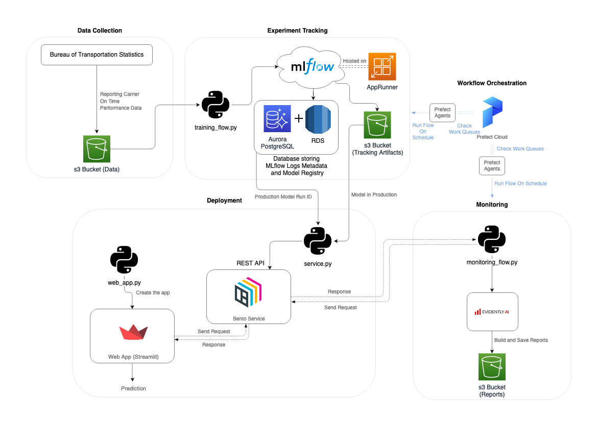
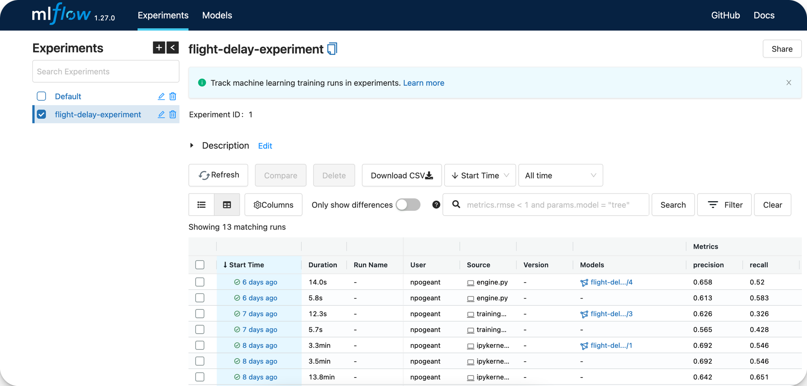
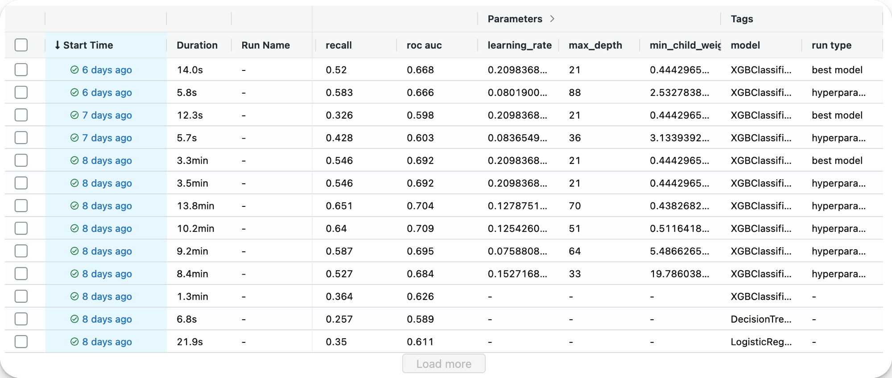
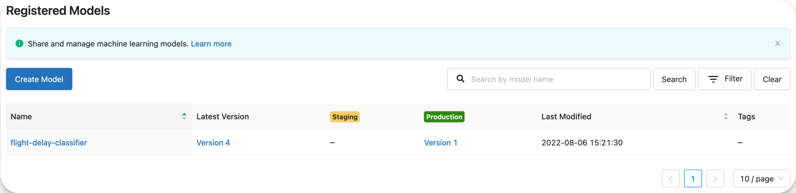
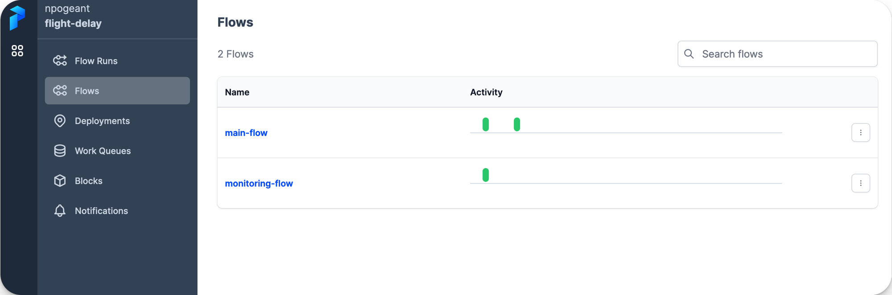
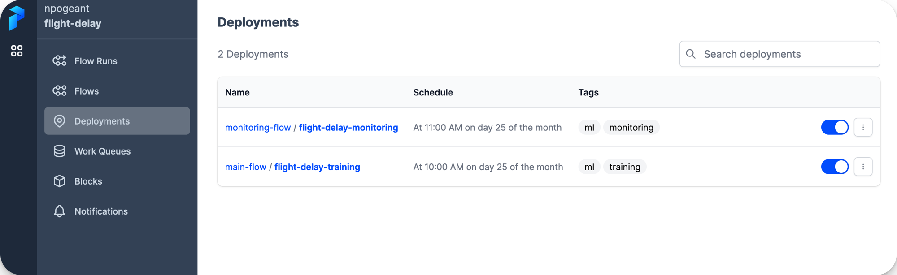

<h1 align="center">Flight Delay Predictor Pipeline
</h1>


*made with draw.io*

## Project description

The project consists of a **Machine Learning Pipeline** built with some of the most important aspects of MLOps : Experiment Tracking, Workflow Orchestration, Model Deployment and Monitoring.

The idea is to solve a machine learning problem (or at least try to) by collecting data, training a model and putting it into production. However, instead of just having a model and deploying it, the real challenge is to have a pipeline that can replicate each process and work continuously. What I mean by continuous basis is the ability to re-train the model with new data and evaluate the performance of the deployed model (this is the monitoring I will introduce later).

## Problem and Data

The problem that this project is trying to solve is the delay of flights on US airlines and at US airports. To address this problem, I used data from the **Bureau of Transportation Statistics** and more precisely, data about [Carrier On-Time Performance](https://www.transtats.bts.gov/Fields.asp?gnoyr_VQ=FGJ). The monthly datasets consist of half a million flights with information about them and a column specifying the delay time. I turned the regression problem into a classification because I just wanted to know if the flight would be delayed.

# Pipeline Steps

Let's explore the steps of this Machine Learning System :

- Data Collection ([here](#data-collection))
- Experiment Tracking ([here](#experiment-tracking))
- Model Deployment ([here](#deployment))
- Monitoring ([here](#monitoring))
- Workflow Orchestration ([here](#workflow-orchestration))

## Data Collection

First, the data are stored in a s3 Bucket (AWS) to be available from anywhere.

I did not automate this step because the data source does not allow direct queries to the data. So in a production environment, the idea would be to download the data and put it in the s3 bucket.

## Experiment Tracking

For this step, I chose to work with **ML Flow** because it is a complete tool both for experiments and the establishment of a model registry.

To have a better experience and be ready for production, I decided to have the MLflow server where the experiments will be, on the cloud. Therefore, I can access it from anywhere as long as I have access to my aws account.

To do so, I used the MLflow tracking server deployment from Doug Trajano ([here](https://github.com/DougTrajano/mlflow-server)) that provides a Terraform stack for creating and initializing the server in an App Runner (AWS). Thus, I have access to MLflow by specifying the following tracking uri : https://XXXXXXXXX.aws-region.awsapprunner.com/.

The code about experiment tracking is inside *training_flow.py*.

1. It retrieves the data from the s3 bucket and preprocesses it.
2. It then splits training and validation data and fits a DictVectorizer.
3. It tunes hyperparameters from an XGboost classifier (in the /notebooks you can find the EDA where I compare multiple algorithms to finally choose XGboost) and logs every metrics in MLflow runs.
4. It gets the best model parameters and trains a new model to keep artifacts inside a s3 bucket.
5. It registers the model (best one) as the production one in the registry if it is a better one than the current model in production (comparing precision metrics).

Here it is the MLflow server UI :



I made sure to have different tags for the runs (*best model* and *hyperparameter tuning*), as you can see at right of this screenshot :



Finally, this is the model registry with production models and archived ones :



## Deployment

This step consists in putting into production the best model resulting from the experiments. I used **BentoML** framework and **Streamlit** library to perform this.

[BentoML](https://github.com/bentoml/BentoML) is an open source python module that allow to serve a model as a REST API, streaming service, batch deployment.

[Streamlit](https://streamlit.io/) is a python library to create web application in a minute.

The code behind this step is inside the */deployment* folder : *service.py* and *wep_app.py*.

The python file *service.py* allows the creation of a REST API service to send requests and get prediction. Here are the steps :

1. Load the DictVectorizer that transform the input data.
2. Load the model from the s3 bucket.
3. Create a BentoML service with the model
4. Build the job of the service by decorating the *predict* function :
```python
@service.api(input=NumpyNdarray(), output=NumpyNdarray())
def predict(data_: np.ndarray) -> np.ndarray:

    ...

    # Get the prediction
    result = model.predict.run(data)

    return result
```

Now that this is done, the file can be used to serve the REST API service directly. :
``` bash
bentoml serve service.py:service
```

Or, as I did, you can create a *bentofile.yaml* where bento configuration is specified. Thus, calling this command will create a **Bento** which is a Docker Image of the REST API service :
```bash
bentoml build
```
Thanks to that, it is possible to use the **Bento** listed by the command *bentoml list* and deploy the image in Heroku, on an EC2, AWS Sage Maker and more...

Now that we have a service where we can send requests, we can develop the web application. The code is in the python file *wep_app.py* and is just a basic streamlit application with inputs that are used in the requests to have the prediction and display it in th web app.
This is the important part of the code where we send a request to the BentoML service running at this endpoint : http://127.0.0.1:3000/predict :
```python
def predict(day_of_week, op_carrier, origin, dep_time, air_time):
    # Convert the bytes image to a NumPy array
    inputs = f'[[{day_of_week}, "{op_carrier}", "{origin}", {dep_time}, {air_time}]]'

    # Send the image to the API
    response = requests.post(API_ENDPOINT, data=inputs)

    if response.status_code == 200:  # pylint: disable=no-else-return
        return response.text
    else:
        raise Exception(f"Status: {response.status_code}")
```

To run the app :
```bash
streamlit run web_app.py
```

Here is how the web app looks like :


## Monitoring

As you can see in the pipeline diagram, I chose **Evidently.ai** to monitor the pipeline. The code of this step is in the python file *monitoring_flow.py*. What does the code do ?

1. Retrieve data and pre-process it. Two datasets are needed to compare reference data and the current data.
2. Load the model and the dictvectorizer.
3. Get predictions from the dataset to be able to compare with the actual targets.
4. Build the dashboard with reports object inside for **Data Drift**, **Categorical Target Drift** and **Classification Performance**.
5. Save the dashboard/reports in a .html file and send it to an s3 bucket.

I chose to create a dashboard to see if any Model Drift or change in Model Performance appears. I could also add alerting and more to have a better way to face issues.

Here is how the dahsboard looks like :


## Workflow Orchestration

This step involves ensuring that some of the previous steps are completed on time and without failure. To perform it, I used **Prefect** and especially **Prefect Cloud** to be able to use the dashboard from everywhere.

I created 2 streams, one for training and one for tracking. The idea is to run these steps with some frequency and keep the model up to date without drifting.
You can find all the prefect tasks inside the python files *training_flow.py* and *monitoring_flow.py* for functions with the **@task** decorator. Flows are the 2 functions (one for each file) decorated with a **@flow**.

Once the flows created, I deployed them in Prefect Cloud by login with my API key in the Prefect CLI API. The first step is to build the deployment by specifying the file and the flow function (with some parameters such as the name of the depoyment) :
```
prefect deployment build ./training_flow.py:main_flow -n flight-delay-training -i process -t ml -t training

prefect deployment build ./monitoring_flow.py:monitoring_flow -n flight-delay-monitoring -i process -t ml -t monitoring
```
A .yaml and .json files are created after the building is finished. The second step is to create the deployment on the API by calling the second commmand :

```
prefect deployment apply ./flight_training-deployment.yaml

prefect deployment apply ./flight_monitoring-deployment.yaml
```

Here is how the flows look like in Prefect Cloud :



And here, the deployments :



The last things needed are the work queues that will send agents to execute the flows when the time is right. I have scheduled a run time each month on a specific day. The goal is to train the model each month as new data comes in and build an obvious dashboard to check for any drift or decrease in performance.

Therefore, I created two work queues directly from Prefect Cloud and when the time comes, the idea would be to run the prefect agent of each work queue from the CLI command :
``` bash
prefect agent start work-queue-id
```
